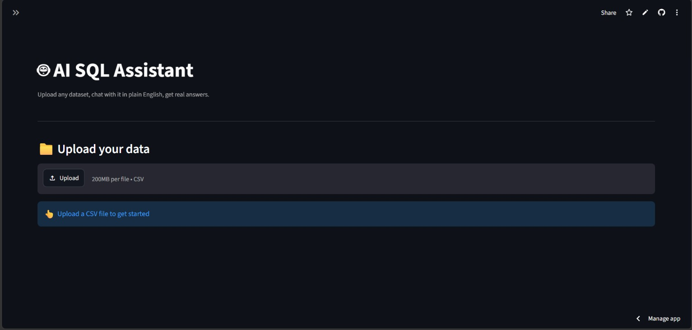
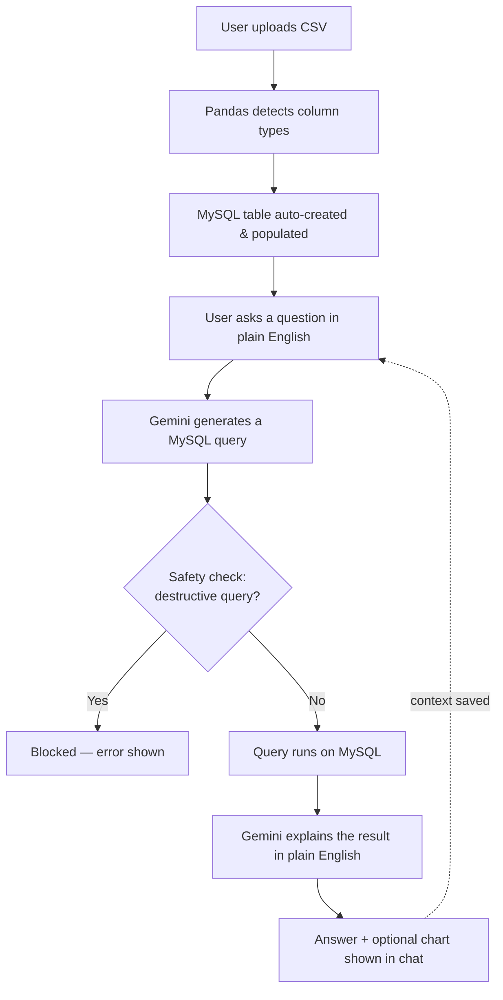

# 🤖 AI SQL Assistant

Upload any CSV, ask questions about it in plain English, and get instant, accurate answers — no SQL knowledge required.

**🔗 Live demo:** [dev-ai-sql-assistant.streamlit.app](https://dev-ai-sql-assistant.streamlit.app)


---

## What it does

Most "chat with your data" tools are hardcoded to one dataset. This one isn't — upload **any** CSV, and the app automatically builds a matching database table, understands its structure, and lets you ask questions about it conversationally.

**Example:**
> **You:** what is the average salary in engineering
> **AI:** The average salary in Engineering is about $91,523.
>
> **You:** what about San Francisco
> **AI:** *(understands you're still asking about Engineering, filters by location automatically)*

---

## Features

- 📁 **Upload any CSV** — no fixed schema, works with any dataset
- 💬 **Chat interface with memory** — follow-up questions understand prior context, not just single-shot Q&A
- 🗣️ **Natural language answers** — not just raw tables; the AI explains results conversationally
- 🛡️ **Safety checks** — blocks any AI-generated query that would modify or delete data
- 🤔 **Honest about limits** — if a question can't be answered from the uploaded data, it says so instead of guessing or hallucinating
- 📊 **Auto-charting** — visualizes results when you ask for comparisons or trends
- 🧹 **Handles messy data** — missing values, duplicate headers, and malformed CSVs don't crash the app

---

## Tech stack

| Layer | Technology |
|---|---|
| Frontend / UI | Streamlit |
| Backend logic | Python |
| Database | MySQL (hosted on Aiven, cloud-deployed) |
| AI | Google Gemini API |
| Data handling | Pandas |

---

## Pipeline



## How it works

1. **Upload** — user uploads a CSV file
2. **Schema detection** — Pandas infers column types (INT, FLOAT, TEXT); a MySQL table is created and populated automatically
3. **Question → SQL** — the user's plain-English question, the table schema, and a data sample are sent to Gemini, which returns a MySQL query
4. **Safety check** — the generated query is scanned for destructive keywords (`DELETE`, `DROP`, `UPDATE`, etc.) before it's ever run
5. **Execute & explain** — the query runs against the database, and the raw result is sent back to Gemini in a second call to produce a natural-language answer
6. **Memory** — recent conversation turns are stored in session state and included in future prompts, so follow-up questions work

---

## Safety & reliability

This wasn't built as a naive "AI writes SQL and runs it" demo. A few deliberate design decisions:

- **No destructive queries ever execute** — a keyword filter blocks `DROP`/`DELETE`/`UPDATE`/`INSERT`/`ALTER`/`TRUNCATE` before execution, regardless of what the AI generates
- **Graceful failure on unanswerable questions** — the AI is explicitly instructed to say `NO_SQL: <reason>` rather than force an answer when a question falls outside the uploaded schema
- **API failure handling** — if the Gemini API is rate-limited or temporarily unavailable, the app shows a clear message instead of crashing
- **No hardcoded credentials** — API keys and database credentials are never committed to source control; they're loaded from environment variables locally and Streamlit Secrets in production

---

## Run it locally

```bash
git clone https://github.com/faisal-devvv/ai-sql-assistant.git
cd ai-sql-assistant
pip install -r requirements.txt
```

Create a `.env` file in the project root:
```
GEMINI_API_KEY=your_key_here
MYSQL_HOST=your_mysql_host
MYSQL_PORT=your_mysql_port
MYSQL_USER=your_mysql_user
MYSQL_PASSWORD=your_mysql_password
MYSQL_DATABASE=your_database_name
```

Then run:
```bash
streamlit run app.py
```

---

## Future improvements

- **True multi-user isolation** — all users currently share one database table (`uploaded_data`), so two people using the live demo simultaneously would overwrite each other's uploaded file; a production version would give each session its own table or namespace
- **IP-restricted database access** — currently open to all IPs for compatibility with Streamlit Cloud's dynamic IPs; a production deployment would use a fixed egress IP or VPC
- **Visible data-quality summary** — surface duplicate/missing-value counts to the user after upload, rather than only handling them silently

---

## Built by

**Faisal** — [GitHub](https://github.com/faisal-devvv)